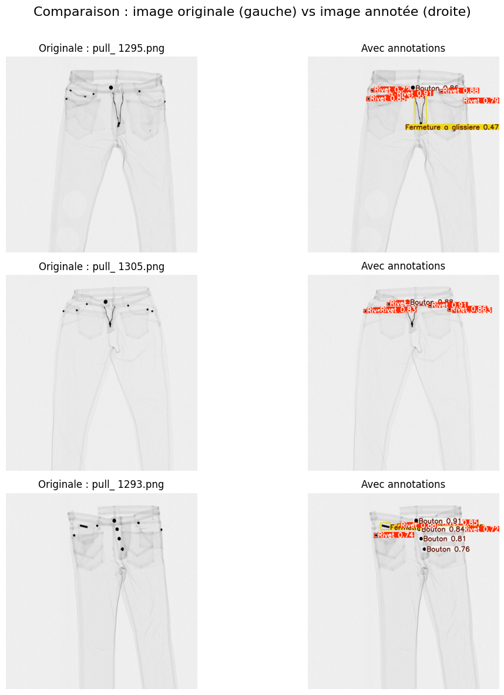

# Détection des elements perturbateurs  sur Vêtements

Ce projet vise à détecter automatiquement les défauts (rivet, bouton, fermeture, oeillet...) sur des vêtements à l’aide d’un modèle YOLO OBB. 
Il permet ainsi en fonction du nombre d'éléments perturbateurs détectés sur les vêtements, d'orienter ces derniers vers le processus de tri adequat

